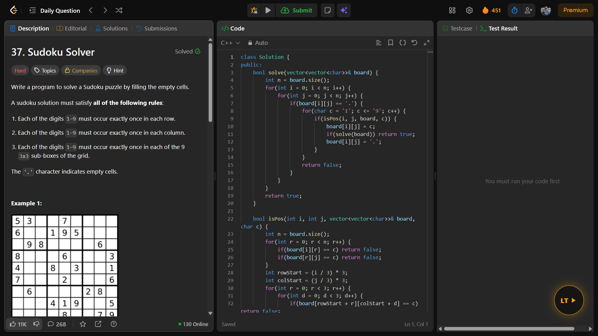
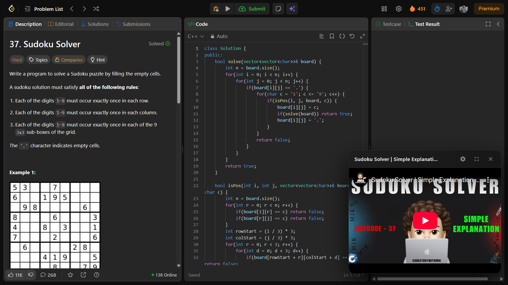
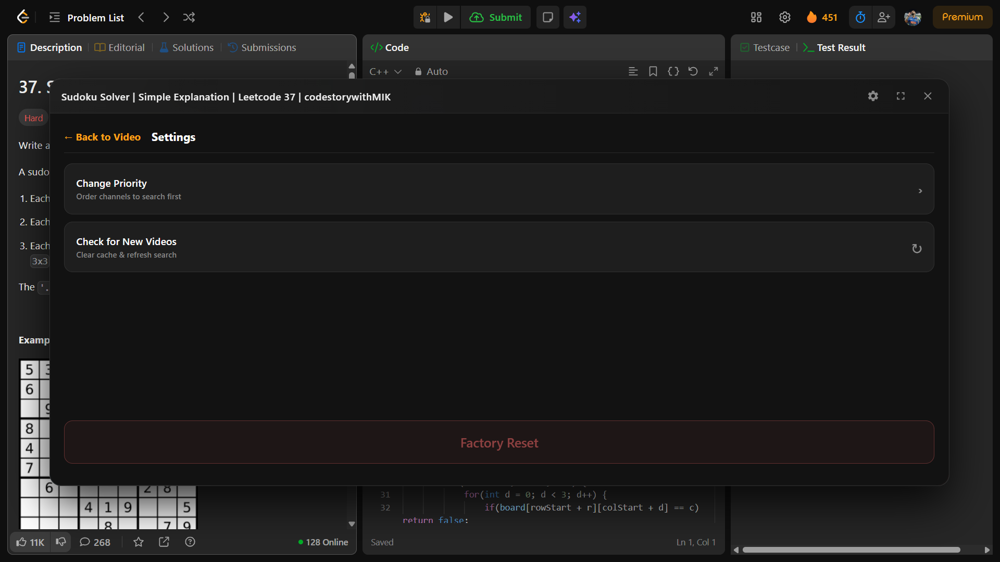
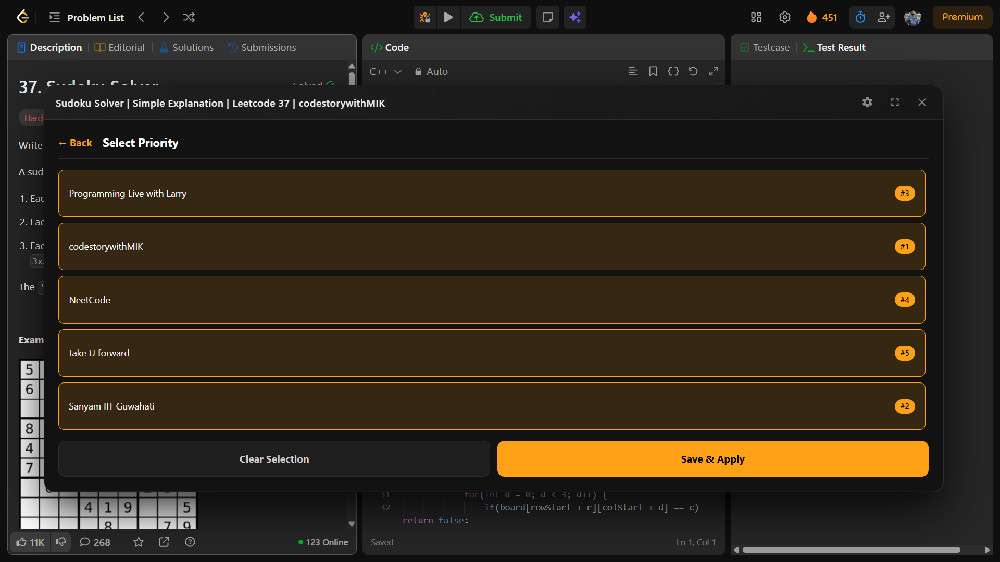
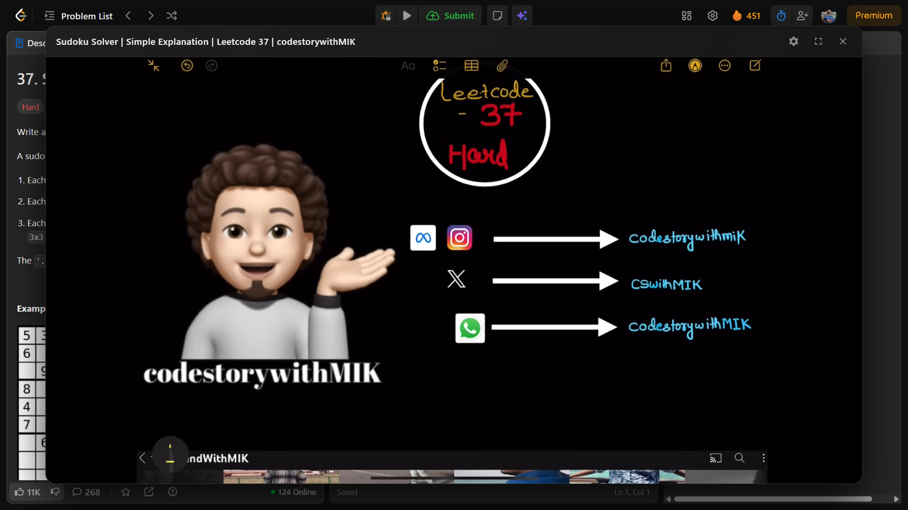

# LeetTube 🎥  
### YouTube Video Solutions for LeetCode

LeetTube is a Chrome extension that automatically shows **YouTube solution videos** directly inside LeetCode problems.

No tab switching.  
No searching.  
Just solve and watch.

---
# 📸 Screenshots

🎈 Seamless Integration

  
 
 Upon loading any LeetCode problem, a non-intrusive <b>"LT" Floating Bubble</b> appears in the corner. It stays out of your way until you need help. 

---

📺 Instant Video Solutions

  
 
 Clicking the bubble instantly opens a <b>Draggable & Resizable Panel</b> that fetches the best solution video for the specific problem without leaving the page. 

---

⚙️ Control Center

  
 
 The <b>Settings Menu</b> allows you to refresh the cache, check for new videos, or perform a factory reset. It’s designed to be simple and accessible. 

---

🏆 Channel Priority System

  
 
 <b>Customize your learning!</b> Reorder your favorite creators (e.g., NeetCode, TakeUForward, Larry) to ensure the script searches your preferred channels first. 

---

🔍 Focus Mode (Maximized View)

  
 
 Need to see the code clearly? The <b>Maximize Button</b> expands the video player to cover the screen, perfect for deep diving into complex explanations. 

---

🖱️ Drag & Drop Experience

  
 
 (Optional GIF) Smooth dragging mechanics allow you to place the video player anywhere on the screen so it never blocks the problem description or code editor. 

---

## 🚀 Download & Install

### 🔗 Download LeetTube  
➡ Click here:  
https://github.com/sanjaymarathi/LeetTube/releases/latest  

Download the file named:  
**LeetTube.zip**

> ⚠️ Important  
> Do NOT download  
> `Source code (zip)` or `Source code (tar.gz)`  
> They will NOT work in Chrome.

---

## 🧩 Installation Steps

1. Download **LeetTube.zip**
2. Extract the ZIP file  
3. Open Chrome and go to  **chrome://extensions**
4. Enable **Developer Mode** (top-right corner)
5. Click **Load Unpacked**
6. Select the extracted **LeetTube** folder

LeetTube is now active 🚀

---

## 🎯 Features

- Automatically detects the LeetCode problem
- Finds the correct YouTube solution video
- Floating Netflix-style video player
- Movable, minimizable, and resizable
- Shows **“Video not available”** if no solution exists
- Works when switching problems without page reload

---

## 🔒 Privacy & Security

- No user data is collected
- No tracking, no ads
- YouTube API key is restricted to Chrome extensions only

---

## 🛠 Support

If a problem does not have a video yet, LeetTube will show:  
**“Video not available – Coming soon”**

The video will appear automatically when it is uploaded in YouTube.

---

Enjoy solving with **LeetTube** 🎯

